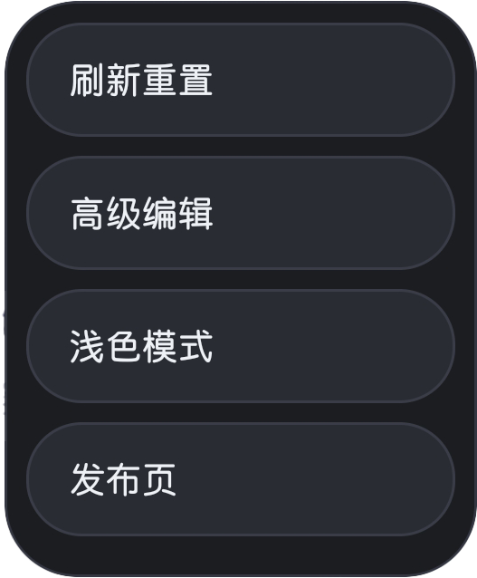
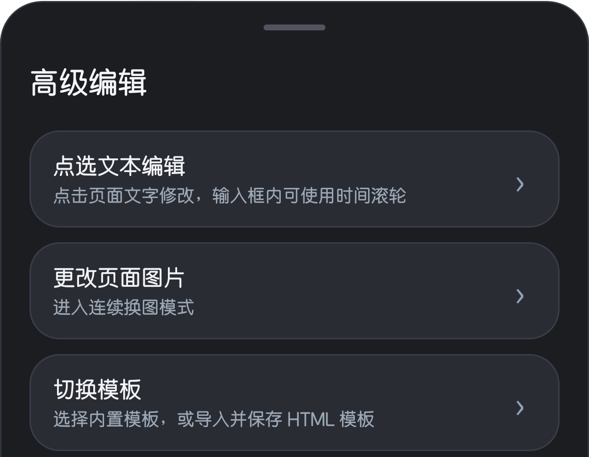
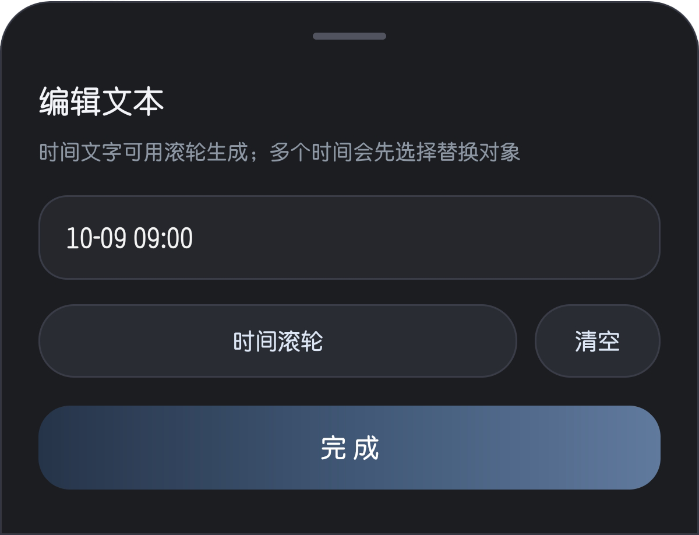
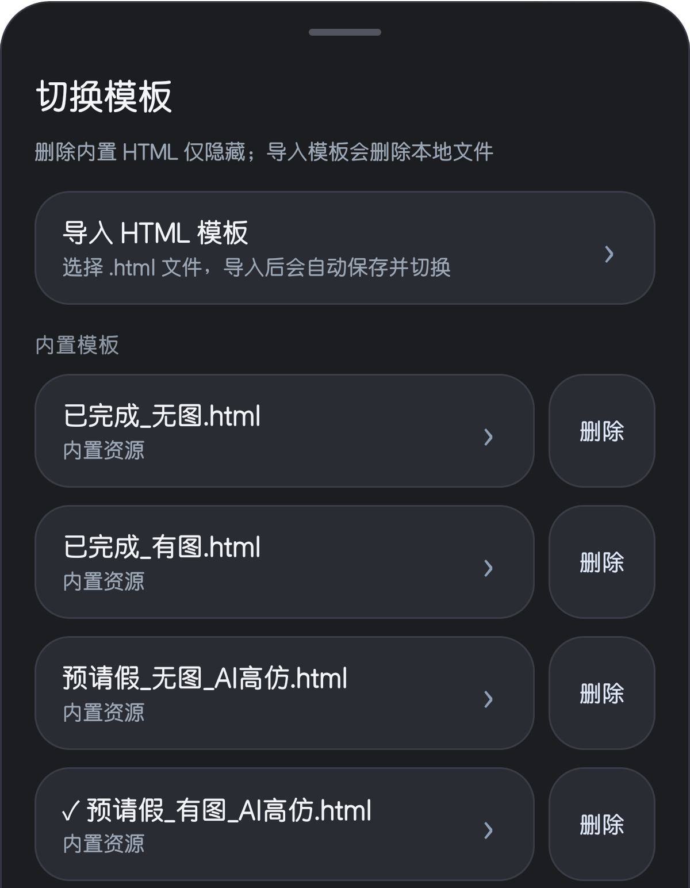

<div align="center">

# 🌊 HeBao

### HB Community · H-Campus 风格 WebView 外壳

<p>
  
  
  
  
</p>

<p>
  <b>一个面向校园 H5 场景的轻量级 Android WebView 外壳。</b><br/>
  本地模板 · 沉浸式容器 · 可视化编辑 · 模板切换 · 原生风格交互
</p>

</div>

---

## ✨ 项目简介

**HeBao** 是一个基于 Android WebView 的本地 H5 模板预览与交互调试项目。

它以 **HB Community / H-Campus** 风格为设计参考，通过一个接近移动端原生体验的 WebView 外壳，让本地 HTML 页面可以在 App 内获得更加自然、沉浸、完整的展示效果。

项目支持本地模板加载、模板切换、外部 HTML 导入、页面文本点选编辑、图片替换、时间滚轮生成、深浅色模式切换等功能，适合用于校园风格 H5 页面研究、WebView 容器学习、移动端页面适配测试和本地模板调试。

> HeBao 的命名灵感来自一种 “HB Community” 风格的校园服务场景。  
> 项目名始终是 **HeBao**。

---

## ⚠️ 使用声明

本项目仅用于：

- H5 页面离线预览
- Android WebView 学习
- 移动端页面适配测试
- 本地 HTML 模板管理实验
- UI 交互设计研究
- Android 与 JavaScript 通信实验

**请勿将本项目用于冒充官方系统、伪造记录、误导他人、绕过学校或组织管理、规避审核，或任何违反法律法规、校纪校规、平台规则的行为。**

因不当使用造成的后果由使用者自行承担。

---

## 📸 界面预览

### 二级菜单

右上角主菜单采用深色圆角卡片和胶囊按钮设计，入口简洁，适合快速进入刷新、高级编辑、主题切换和发布页等操作。

<p align="center">
  
</p>

### 高级编辑菜单

高级编辑作为主要功能入口，集中放置文本编辑、图片替换和模板切换能力，保持原有 BottomSheet 风格，视觉层级清晰。

<p align="center">
  
</p>

### 文本编辑面板

文本编辑面板支持直接修改当前选中的页面文字，并提供时间滚轮与清空按钮，适合快速调试页面中的日期、时间与普通文本内容。

<p align="center">
  
</p>

### 模板切换面板

模板切换面板支持导入 HTML、选择内置模板、管理模板列表。内置模板可隐藏，导入模板可真实删除，当前模板会以勾选状态标记。

<p align="center">
  
</p>

---

## 🚀 功能亮点

### 🧩 本地 H5 模板加载

支持从 `assets` 中加载本地 HTML 页面，让模板无需联网即可在 WebView 中运行。

- 支持 `.html` / `.htm`
- 支持离线加载
- 支持本地资源访问
- 支持移动端 WebView 环境
- 支持模板自动索引

---

### 🎛️ 模板切换系统

内置 **“切换模板”** 菜单，可在多个 H5 模板之间快速切换。

<p align="center">
  
</p>

- 自动扫描 `assets` 中的 HTML 文件
- 支持外部 HTML 导入
- 导入模板会保存到 App 私有目录
- 记住上次选择的模板
- 支持隐藏内置模板
- 支持删除导入模板

> 注意：内置模板属于 APK 打包资源，App 运行时无法真正删除。  
> 对内置模板执行“删除”时，实际含义是从模板列表中隐藏。  
> 导入模板则会从本地存储中真实删除。

---

### 🖊️ 点选文本编辑

进入点选文本编辑模式后，页面中的可编辑文本会被自动标记。

点击文本即可唤起底部编辑面板，修改内容后会实时更新到当前页面中。

<p align="center">
  
</p>

- 自动识别页面文本节点
- 保留页面原有布局
- 点击文字即可编辑
- 支持实时更新 WebView 页面
- 支持退出编辑模式后恢复普通状态

---

### 🕒 时间滚轮工具

内置类 iOS 风格时间滚轮，方便快速生成不同格式的时间文本。

支持识别并生成多种常见格式：

- `yyyy-MM-dd HH:mm`
- `yyyy/MM/dd HH:mm`
- `yyyy年MM月dd日 HH:mm`
- `MM-dd HH:mm`
- 带秒时间格式

适合在本地模板调试时快速调整时间显示内容。

---

### 🖼️ 图片替换模式

进入图片编辑模式后，页面中的图片会被高亮标记。

点击目标图片即可从系统文件选择器中选择新图片，并以 Base64 Data URL 的形式注入到当前页面。

- 支持连续换图
- 点击图片直接替换
- 支持常见图片格式
- 无需手动修改 HTML 文件
- 替换结果即时显示在 WebView 页面中

---

### 🌗 深色 / 浅色模式

App 外壳支持深色和浅色模式。

- 启动时跟随系统模式
- 可在菜单中手动切换
- 顶栏、弹窗、胶囊按钮同步适配
- 保持统一的视觉风格

---

### 🪟 原生风格 BottomSheet 菜单

项目大量使用 BottomSheet 风格交互，搭配圆角面板、胶囊按钮和轻量动画，让整体操作更接近现代移动端 App。

<p align="center">
  
</p>

- 圆角底部面板
- 胶囊式菜单项
- 轻量按压动画
- 深浅色自适应
- 移动端优先的交互体验

---

## 🧭 操作路径

```text
右上角菜单
  ├─ 刷新重置
  ├─ 高级编辑
  │   ├─ 点选文本编辑
  │   │   ├─ 编辑文字
  │   │   ├─ 时间滚轮
  │   │   └─ 清空
  │   ├─ 更改页面图片
  │   └─ 切换模板
  │       ├─ 导入 HTML 模板
  │       ├─ 选择内置模板
  │       ├─ 隐藏内置模板
  │       └─ 删除导入模板
  ├─ 深色 / 浅色模式
  └─ 发布页
```

---

## 🧱 技术栈

| 模块 | 技术 |
|---|---|
| 主语言 | Kotlin |
| 平台 | Android |
| 页面容器 | WebView |
| 页面通信 | JavascriptInterface |
| UI 弹窗 | Material BottomSheetDialog |
| 模板资源 | assets / App 私有目录 |
| 图片导入 | ActivityResultContracts.GetContent |
| 本地持久化 | SharedPreferences / Internal Files |

---

## 📂 推荐目录结构

```text
app/
├─ src/
│  └─ main/
│     ├─ java/
│     │  └─ com/example/hebao/
│     │     └─ MainActivity.kt
│     ├─ assets/
│     │  ├─ template_a.html
│     │  ├─ template_b.html
│     │  └─ templates/
│     │     └─ extra_template.html
│     └─ res/
│        └─ layout/
│           └─ activity_main.xml
```

导入的 HTML 模板会保存在 App 私有目录：

```text
filesDir/imported_html_templates/
```

---

## 🛠️ 构建方式

### 1. 克隆项目

```bash
git clone https://github.com/CAPTCHAAAAA/HeBao.git
```

### 2. 使用 Android Studio 打开

打开项目根目录，等待 Gradle Sync 完成。

### 3. 添加 HTML 模板

将 HTML 文件放入：

```text
app/src/main/assets/
```

或：

```text
app/src/main/assets/templates/
```

### 4. 构建运行

```bash
./gradlew assembleDebug
```

也可以直接在 Android Studio 中点击运行按钮。

---

## 📌 模板管理说明

### 内置模板

内置模板位于：

```text
app/src/main/assets/
```

特点：

- 随 APK 一起打包
- 可被自动扫描
- 可离线使用
- 可从列表中隐藏
- 运行时无法真正物理删除

### 导入模板

导入模板来自用户手动选择的本地 HTML 文件。

特点：

- 会复制到 App 私有目录
- 会显示在模板列表中
- 可随时切换使用
- 可真实删除
- 删除后需要重新导入才能恢复

---

## 🧠 设计理念

HeBao 的目标不是做一个复杂的大浏览器，而是做一个轻量、稳定、沉浸的 H5 页面运行外壳。

它更像是一个：

> 披着原生 Android 外壳的 H-Campus 风格 H5 实验台。

少一点干扰。  
多一点沉浸。  
少一点配置。  
多一点即开即用。

让页面预览、模板切换、文本修改、图片替换这些操作都尽可能自然、顺滑。

---

## 🗺️ Roadmap

- [x] 本地 assets HTML 加载
- [x] WebView 基础外壳
- [x] JavaScript Bridge 通信
- [x] 点选文本编辑
- [x] 图片替换模式
- [x] 时间滚轮工具
- [x] 深色 / 浅色模式
- [x] 模板切换
- [x] 外部 HTML 导入
- [x] 导入模板删除
- [x] 内置模板隐藏
- [ ] 模板分组
- [ ] 模板重命名
- [ ] 模板预览缩略图
- [ ] 配置导入 / 导出
- [ ] 模板元数据支持
- [ ] 更完整的 H5 调试面板

---

## 🤝 参与贡献

欢迎提交 Issue 或 Pull Request。

可以改进的方向包括：

- UI 细节优化
- WebView 兼容性增强
- 模板管理能力扩展
- 代码结构整理
- 文档完善
- 更多 H-Campus 风格页面适配

---

## 📄 License

本项目仅供学习、研究和合法场景下的本地 H5 页面预览使用。

请在遵守所在地法律法规、学校/单位规定及平台规则的前提下使用。

---

<div align="center">

### HeBao

<b>HB Community · H-Campus WebView Shell</b>

</div>
